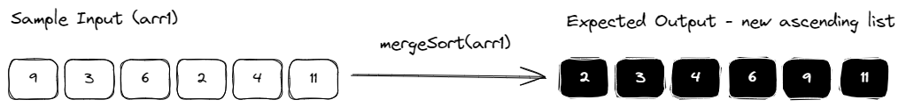
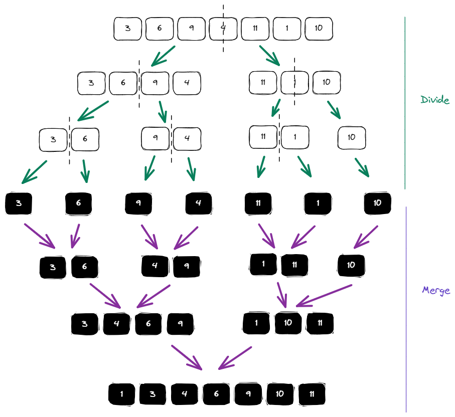

## Merge Sort

Implement a function that performs a recursive merge sort. The function should be recursive and takes in an array of integers. The output should be an array with the input sorted in ascending order.



## Example

```js
mergeSort([9, 3, 6, 2, 1, 11]); // [1, 2, 3, 6, 9, 11]
mergeSort([12, 16, 14, 1, 2, 3]); // [1, 2, 3, 12, 14, 16]
```

## Recap

Merge sort is a recursive algorithm that divides and conquers - it continuously divides the input array into two halves until it cannot be further divided (i.e. reaches the base case of array <= 1 element(s) - which by definition, is sorted). The "merge" section of the algorithm then repeatedly merges individually sorted subarrays into larger arrays until the entire array is merged.

The merging process involves creating a new empty array and repeatedly taking the smallest element from either the first or second half. When one half is empty, we append all elements from the other half to the new array and return it.



Merge sort is a stable comparison-based algorithm, with a time complexity of O(nlog(n)) in all cases. It is commonly used in practice as a general-purpose algorithm for sorting arrays of all sizes.

## Clarification Questions

If unspecified:

- Should the data be sorted in an ascending or descending order?
- Should the data be sorted in-place or is it acceptable to use additional data structures?
- What kinds of inputs do we need to handle?
  - Will it just be an array of integers or should we handle other data types?
  - Are there a large number of duplicate elements?
  - How should negative numbers be handled?

## Solution

Note: This question tackles a standard merge sort which is recursive and not "in-place" for an output in ascending order.

JS

```js
/**
 * @param {Array<number>} arr The input integer array to be sorted.
 * @return {Array<number>}
 */
export default function mergeSort(arr) {
  // Return if array only has 0 or 1 elements (base case).
  if (arr.length <= 1) {
    return arr;
  }

  // Divide the array into two.
  const midPoint = Math.floor(arr.length / 2);
  const left = arr.slice(0, midPoint);
  const right = arr.slice(midPoint);

  // Merge sort each half recursively.
  const sortedLeft = mergeSort(left);
  const sortedRight = mergeSort(right);

  // Merge sorted halves.
  return merge(sortedLeft, sortedRight);
}

/**
 * Merges two sorted arrays of elements into one.
 * @param {Array<number>} left
 * @param {Array<number>} right
 * @return {Array<number>}
 */
function merge(left, right) {
  // Create an empty array to store the merged result.
  const mergedResult = [];

  let l = 0;
  let r = 0;
  // Repeatedly compare smallest element from each half
  // and append it to the merged result.
  // When one half runs out of elements,
  // append all the elements of the remaining half to the merged array
  while (l < left.length && r < right.length) {
    if (left[l] < right[r]) {
      mergedResult.push(left[l]);
      l++;
    } else {
      mergedResult.push(right[r]);
      r++;
    }
  }

  // Append any remaining elements from each sides.
  mergedResult.push(...left.slice(l), ...right.slice(r));
  return mergedResult;
}
```

TS

```js
export default function mergeSort(arr: Array<number>): Array<number> {
  // Return if array only has 0 or 1 elements (base case).
  if (arr.length <= 1) {
    return arr;
  }

  // Divide the array into two.
  const midPoint = Math.floor(arr.length / 2);
  const left = arr.slice(0, midPoint);
  const right = arr.slice(midPoint);

  // Merge sort each half recursively.
  const sortedLeft = mergeSort(left);
  const sortedRight = mergeSort(right);

  // Merge sorted halves.
  return merge(sortedLeft, sortedRight);
}

/**
 * Merges two sorted arrays of elements into one.
 */
function merge(left: Array<number>, right: Array<number>): Array<number> {
  // Create an empty array to store the merged result.
  const mergedResult = [];

  let l = 0;
  let r = 0;
  // Repeatedly compare smallest element from each half
  // and append it to the merged result.
  // When one half runs out of elements,
  // append all the elements of the remaining half to the merged array
  while (l < left.length && r < right.length) {
    if (left[l] < right[r]) {
      mergedResult.push(left[l]);
      l++;
    } else {
      mergedResult.push(right[r]);
      r++;
    }
  }

  // Append any remaining elements from each sides.
  mergedResult.push(...left.slice(l), ...right.slice(r));
  return mergedResult;
}
```

## Edge Cases

- Non-integer element input: If the input array comprises of elements of different data types, you may need to return an error, settle for sorting on a best-effort basis, for e.g., only sorting a subset of the input data, or even define custom comparison functions for non-integers.
- Single element / Empty input: Either return the original data structure, raise an error, or clarify required handling.
- Already sorted input: You may want to detect sorting and return the input unchanged.
- Invalid input: If the input is not a array, consider throwing an error.

## Time Complexity

In the case of merge sort, the best, average and worst case time complexity are all O(nlog(n)). This means that the time taken for sorting is directly proportional to the product of the array size and logarithm of array size.

The dividing step has a time complexity proportional to the height of the binary tree created due to repeated divisions of the input array in half, and the number of steps is log(n) + 1 at most. Finding the middle of any subarray is a single-step operation that costs O(1). Hence, we expect a time complexity of O(log(n)) for this.

The merging step takes O(n) time for each subarray created by division, as it requires combining of n elements into a single sorted list.

Overall, the time complexity of merge sort is n(log(n) + 1) = O(nlog(n)).

## Space Complexity

In terms of space complexity, it is O(n) for a standard merge sort that is recursive and not in-place. The merge step requires the creation of a new array to store the merged result of the 2 halves. At the very last merge step, we expect the array to be as large as the input array. Hence, the space requirement is linear.
